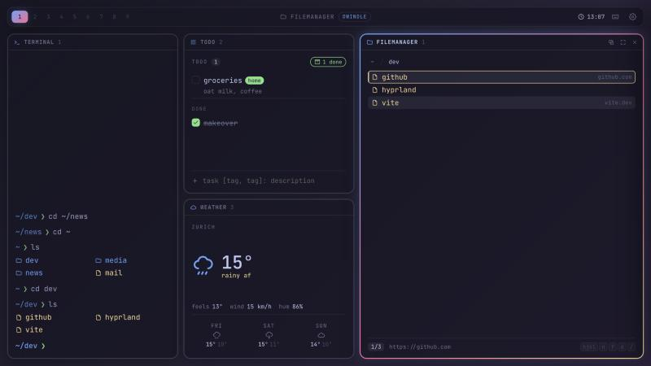

# BASHRC



## Running it

Needs a current node version (18+).

```
npm install
npm run dev      # dev server on http://localhost:5173
npm run build    # production build into dist/
```

The build output in `dist/` is completely static, so it can be dropped on any
web host (or used as a local start page via a `file://` url).

### Deploying to vercel

The repository ships a `vercel.json`, so there is nothing to configure: import
the repo on [vercel.com/new](https://vercel.com/new) and deploy. Vercel runs
`npm run build` and serves `dist/`. Pushes to `master` go to production, every
other branch gets a preview deployment.

From the command line it is:

```
npx vercel        # preview deployment
npx vercel --prod # production deployment
```

There is no backend and no environment variable to set: bookmarks, todos and
settings all live in the browser's local storage, and the weather applet talks
to open-meteo directly.

## Functionality

The basic principle of this startpage is to act as a bookmark repository.
...But in a very cool way.

This is a start page heavily inspired by my linux desktop setup, where I mainly operate in the terminal or terminal-based applications. Naturally, I'd like my browser startpage to be keyboard oriented as well. But it should also look nice.

Directories in the file system resemble bookmark categories and Files are named links to your webpages.

The idea is to act like an os with a desktop environment, a file manager and
open programs that are arranged on the page by a window manager.

## Window manager

The layout is a tiling one, modelled after hyprland's default **dwindle**
layout: the workspace is a binary tree, and a new window splits the focused
window's space along its longer side. No window ever overlaps another one and
no space is wasted. Drag the gap between two windows to move their split, or
resize with the keyboard.

Every window can be popped out of the tiling with `mod + v`, after which it
floats above the tiles and can be dragged by its title bar and resized from its
bottom right corner. `mod + f` makes the focused window fill the screen.

### Workspaces

There are nine workspaces, switched with `mod + 1 … 9`. A window moves to
another workspace with `mod + shift + 1 … 9`. The bar at the top shows which
workspaces hold windows; the current one is highlighted.

### Keybindings

`mod` is **alt** by default, and that is on purpose: a web page cannot prevent
the browser from acting on `super + 1` or most `ctrl + letter` combinations,
while `alt` always reaches the page. It can be changed to ctrl or super in the
settings. Press `mod + /` for the full list at any time.

| keys | action |
| --- | --- |
| `mod + return` | new terminal |
| `mod + e` / `w` / `t` | new file manager / weather / todo list |
| `mod + q` | close the focused window |
| `mod + f` | toggle fullscreen |
| `mod + v` | toggle floating |
| `mod + tab` | cycle focus |
| `mod + h j k l` | focus left / down / up / right (arrow keys work too) |
| `mod + shift + h j k l` | swap the focused window with its neighbour |
| `mod + ctrl + h j k l` | resize the focused window |
| `mod + 1 … 9` | switch workspace |
| `mod + shift + 1 … 9` | send the focused window to a workspace |
| `mod + s` | settings |
| `mod + /` | keybindings |

Window positions, sizes, workspaces and the layout tree are stored in local
storage, so a reload brings the session back as it was.

### Themes

Six presets ship with the page: catppuccin mocha (the default), tokyo night,
nord, gruvbox dark, rosé pine and everforest. Gaps, corner rounding, border
width, background blur, window opacity, animations and the status bar can all
be adjusted in the settings panel, as can the wallpaper, which takes any image
url.

## Available programs

### shell

available commands:
- cd [path]: change directory
- ls [path]: list content of directory
- touch [path, url]: create file linking to [url]
- rm [path]: remove file
- mkdir [path]: create new directory
- rmdir [path]: remove directory
- fetch: cool system information
- echo [args]: print [args] to stdout
- pwd: print current working directory
- open [path]: open url of file at [path] in new tab
- locate [query]: search the query on duckduckgo
- help: list the available commands
- clear: clear stdout

The shell keeps its scrollback: every command stays on screen above the prompt
with what it printed, up to a hundred entries, and `clear` empties it.

Bookmark urls may be entered without a protocol, `https://` is added
automatically. Besides tab completion, the up and down arrow keys cycle through
the command history.

There is autocompletion for both commands and paths. you can invoke it by starting to type something and then hitting 'tab'. You can cycle through suggestions with tab and accept one with 'enter'. If there is only one suggestion, 'tab' will also work for accepting.


### filemanager

Modeled after the linux file manager 'fff' (fucking fast filemanager).
It is completely keyboard based.

#### controls

You can move up and down the content of the current directory with the arrow
keys or with 'j' and 'k'.
- Right arrow key (or 'l' or 'enter') either enters the selected item if its a directory or opens the url of the file if its a file.
- Left arrow key (or 'h') goes into the parent directory of the current dir
- input 'f' to add a new file
- input 'n' to add a new dir
- input '/' to search in the current dir
- input ':' to open a file/directory by typing its name
- input 'd' to go into 'deletion' mode: All (with 'd') selected elements will be deleted uppon pressing 'p'. Directories can only be deleted if they are empty.
- input 'esc' to leave the input prompt or deletion mode, if one of them is open or to cancel the filter applied by searching.

The path at the top is a breadcrumb, clicking one of its segments jumps
straight up to that directory. The status bar at the bottom shows the position
in the listing and, for the selected entry, where it points: the url of a
bookmark or how many items a folder holds. While entries are marked for
deletion it counts those instead.

### weather 

Current conditions for your city, with what it feels like, wind and humidity,
and a three day forecast. Set the city in the settings; it refreshes itself
every twenty minutes and on the button in its corner. It uses the open-meteo
api, which needs no account and no api key.

###  todo

a tiny todo tracker. todos store a name and a description of a task, as well as
0 to several tags for marking tasks that belong to the same category (work, private,
university, some project, whatever). A new tag is given a colour from the theme
straight away; click it to pick a different one from the colour strip.

Ticking a task moves it to a done list that is folded away behind the counter
in the header, and clicking it there puts it back.


### Settings

The cog in the bar opens the settings, as does `mod + s`. Applications are
launched from there, and it is where the theme, the window decorations, the
modifier key, your city and the wallpaper live.

The wallpaper option needs to be a valid url of an image; leaving it empty
falls back to the gradient that belongs to the current theme.

The terminal and the file manager share their working directory, so navigating
in one of them moves the other one as well.

### Resetting

The bottom of the settings panel has two buttons: 'reset layout' puts the
windows back to a terminal and a file manager on workspace one, 'reset
settings' restores the default theme and decorations. Neither of them touches
your bookmarks or todos, those are stored separately.

### Active TODO list

- a second layout, master/stack
- special workspace (hyprland's scratchpad)

### General remarks

Links and dirs are clickable in all programs as well, but thats not the point of this website right?.

All bookmarks are currently stored in local storage, so you might now want to clear your cache if you stored a lot of bookmarks on the page. I am planning on porting the page into a chrome extension to get better storage options.

It should work with all modern browsers, however I'm mainly using firefox and can't guarantee that everything looks nicely on other browsers.

The window blur uses `backdrop-filter`. If a browser does not support it the
windows simply stay translucent without the blur, and it can be switched off in
the settings anyway.

